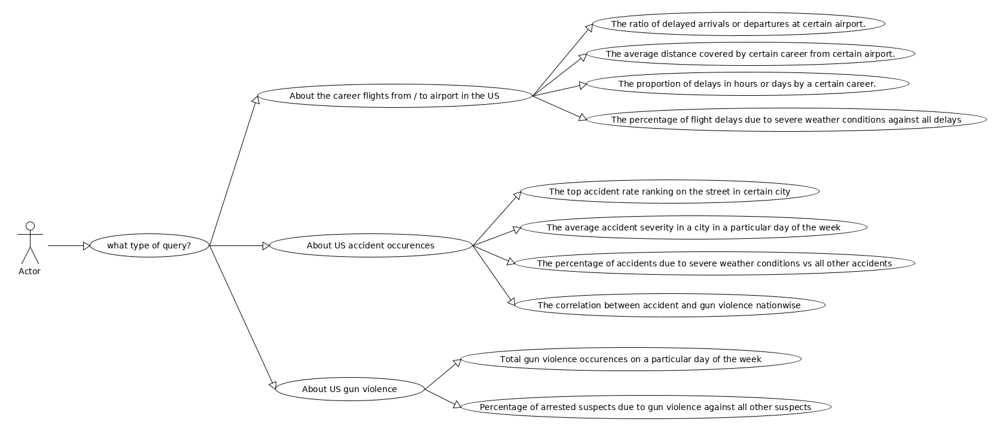

## Database System Final Project

### Participants

Charly Huang: huangc11@rpi.edu

Kuangzheng Li: lik15@rpi.edu

### Motivation

This DBMS stored several US turbulance data, including Four Kaggle Datasets

+ US Flight Delays

  https://www.kaggle.com/niranjan0272/us-flight-delay

+ US Gun Violence

  https://www.kaggle.com/ericking310/us-gun-violence

+ US Accidents

  https://www.kaggle.com/sobhanmoosavi/us-accidents

+ Historical Hourly Weather Data

  https://www.kaggle.com/selfishgene/historical-hourly-weather-data#humidity.cs

+ Several tiny datasets including US state abbrevation and Airline Code datasets also involved here.

User could use self-guide command line interfaced app to explore within those datasets in a degree.

### Installation

This project relys on python3 and postgresql

#### Environment Setting

```shell
brew install postgresql
brew services start postgresql
cd Final
python3 -m venv venv3
source ./venv3/bin/activate
pip3 install -r requirements.txt
tar -xzvf normalized_dataset.tar.gz
tar -xzvf xmls.tar.gz
```

#### Normalization

```
python3 -m normalization "YOUR_ORIGINAL_DATASETS_DOWNLOADED_FROM_KAGGLE"
```

### Load Data

```
bash load_data.sh
```

#### App Start

```
bash app.sh
```

### Exploration Examples

The decision tree for which the user will follows can be seen in Fig. 1. The usage of the interface is very straight-forward. To start, follow the examples indicated in the subsequent sub-sections.



Fig. 1 The Exploration decision tree diagram.

#### Example 1: The top accident rate ranking on the street in certain city

Choose the options as indicated.

What type of queries do you want? `About US accident occurence`
What is your particular query? `The top accident rate ranking on the street in certain city`
Which city to investigate? `Houston, Texas`
How many top ranks do you want to keep? `10`

And the return messages would look like:

```
street                     accident_num
-----------------------  --------------
I-45 N                              681
US-59 S                             468
I-45 S                              464
US-59 N                             369
US-90 E                             301
I-610 E                             299
I-10 W                              291
Westheimer Rd                       278
I-610 W                             254
W Sam Houston Tollway S             228

```

#### Example 2: The percentage of flight delays due to severe weather conditions against all delays

Choose the options as indicated.

What type of querry do you want? `About the career flights from / to airport in the US`
Is it a departuring flight? `y`
Search for dealays of how many minutes? `20`
Choose the airport of departure. `EFD`

The terminal should return

```
weather_description      ratio
---------------------  -------
heavy intensity rain         1
```

#### Example 3: otal gun violence occurences on a particular day of the week

What type of querry do you want? `About US gun violence`
What is your particular query? `Total gun violence occurences on a particular day of the week`
Choose the city to investigate `San Francisco, California`

The returned messages should be

```
  dow    occurance
-----  -----------
    1            9
    2            8
    3           12
    4           15
    5           11
    6           16
    7           16
```

### Unit tests

To run the unit tests, `cd ` to the root directory of this project, then issue the command

```
python3 -m unittest tests/<the unit test file>
```

For instance,

```
python3 -m unittest tests/test_query_list.py
python3 -m unittest tests/test_specific_queries.py
```
